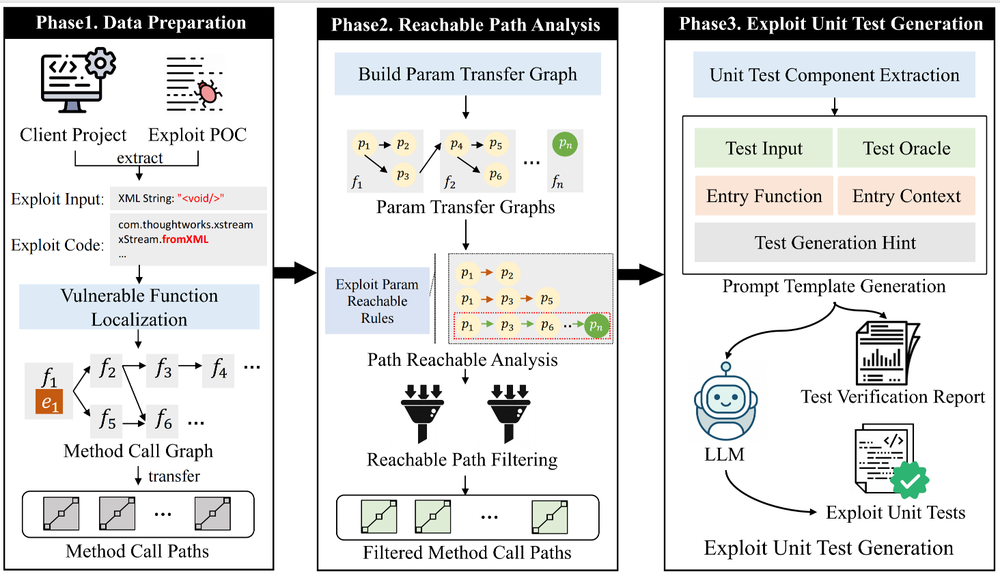

# VulEUT
> This is the basic implementation of our submission in ISSTA 2024: Test Guided Exploitability Verification of Library Vulnerabilities.
- [Description](#Description)
- [Project Structure](#ProjectStructure)
- [Datasets](#Datasets)
- [Method](#Method)
- [Usage](#Usage)

## Description
> Open-source third-party libraries are widely used in modern software development. These libraries offer substantial advantages in
terms of time and resource savings. However, a significant concern arises due to the continuous appearance of publicly disclosed
vulnerabilities within these libraries. Existing automated vulnerability detection tools often suffer from false positives and fail to
accurately assess the propagation of inputs capable of triggering
vulnerabilities from client projects to vulnerable code. In this paper,
we propose a novel approach called VulEUT (Vulnerability Exploit
Unit Test Generation), which combines vulnerability exploitation
reachability analysis and LLM-based unit test generation. VulEUT
is designed to automatically verify the exploitability of vulnerabilities in third-party libraries commonly used in client software
projects. VulEUT first analyzes the client projects to determine the
reachability of vulnerability conditions within them. Subsequently,
it leverages the Large Language Model (LLM) to autonomously generate unit tests for vulnerability verification. To evaluate VulEUT’s
performance, we collect vulnerabilities from various third-party
libraries and conduct experiments on 48 real client projects. Besides, we also compare our approach with the representative tool
TRANSFER. Our results demonstrate the effectiveness of VulEUT,
with 178 out of 210 generated unit tests successfully confirming
vulnerability exploitation across 42 client projects, exceeding the
baseline by more than 7 times.

## ProjectStructure
```
VulEUT
├── dataset  - Experimental data.
│   ├── tables - Result data, including experimental results, etc.
│   └── output - Contains client projects, CVE IDs, generated prompts, and unit tests.
├── src  - Project source code.
│   ├── antlr - Toolkit for generating AST.
│   ├── utils - Common utilities for logging, file operations, etc.
│   └── core
│       ├── entity - Includes prompt model, project source code structure, etc.
│       ├── prompt - Generates specific prompts.
│       └── processor - Includes logic for source code analysis, prompt generation, test generation, etc.
├── test  - Project test files.
└── resources - Project configuration files, including scanned client projects,  etc.
```

## Datasets
Complete dataset：[Table](https://github.com/pocmigrator/VulEUT/tree/main/dataset/tables)

| TPL     | CVE_ID        | client project | call path num | tests | compile tests | pass tests |
|---------|---------------|----------------|---------------|-------|---------------|------------|
| Xstream | CVE-2017-7957 | Lion           | 4             | 8     | 8             | 7          |

## Method
> The implementation process of this method can be summarized as follows: first, perform code analysis on your project, and then attempt to generate unit tests that can exploit vulnerabilities in third-party libraries. If the test code is successfully generated, it indicates that you should be cautious, as your project may now be exposed to vulnerability exploitation risks. It is recommended to manually verify and address vulnerabilities in third-party libraries, such as upgrading library dependencies. 

  
   
  
 
A generated test may look like this:  

``` java
@Test public void testXml2ObjCallsVulnerabilityMethod() {
    String input = "<void>";
    // Set up an interceptor to detect calls to the XStream.fromXML method
    MethodCallInterceptor.interceptor(
        com.thoughtworks.xstream.XStream.class, "fromXML", new Object[]{input});
    try {
        XmlUtil.xml2Obj(input, Object.class);
    } catch (Exception e) {
        e.printStackTrace();
    }
    // Verify if a call to the XStream.fromXML method was triggered
    assertTrue(MethodCallInterceptor.isTrigger);
}
```
## Environment


## Usage
### Step 1: Task Parameter Configuration
Supplement parameter configurations in the task.properties file, including target project file paths, POC code information, and more.

### Step 2: Generate Prompts
Execute the Main class; this process will generate method call chains, perform parameter passing analysis, and construct prompts.

### Step 3: Generate Unit Tests
Invoke the GPT interface, which will produce complete test files.

### Step 4: Run Tests
Place the generated test files and the `MethodCallInterceptor` into the target project's test directory, and then execute the unit tests, which will produce output results.


> If unit test code for exploiting vulnerabilities has been generated and the generated unit tests pass when executed in the client's project, it indicates that the project is currently at risk of exploitation.
